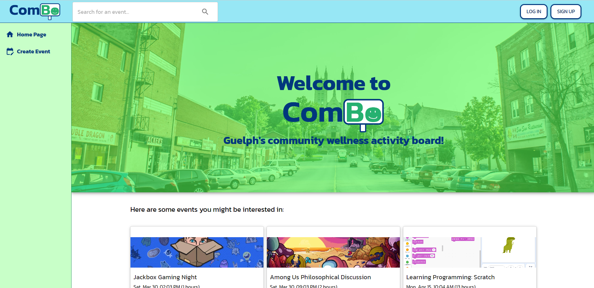
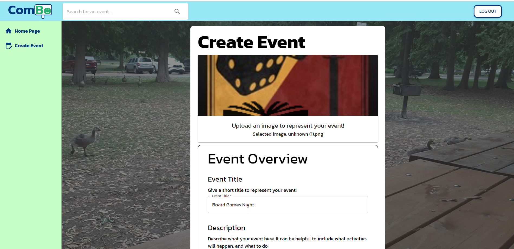

# ComBo: Community Event Board


A community board connecting Guelph residents to various wellness events and activities in the city.
Users can attend, volunteer for and host various wellness events.


## Required Libraries

- Node (v20.11)
- Yarn
- Python 3.10.1
- Serve

In addition, you will need to have the VS Code extension Prettier Eslint.

## Installation

Run the following line in the terminal

```bash
yarn
```

This should install all modules, and should take a few minutes.

### Initialization of Flask Back-end

```
cd backend
```

If the venv folder does not already exist, run the following command

```
python -m venv venv
```

then run

```
venv\Scripts\activate
```

Installing required python libraries:

```
pip install flask python-dotenv
```

```
pip install -U flask-cors
```

## Available Scripts

In the project directory, you can run:

### `yarn start`

Runs the app in the development mode.\
Open [http://localhost:3000](http://localhost:3000) to view it in your browser.

The page will reload when you make changes.\
You may also see any lint errors in the console.

### `yarn start-server`

Runs the backend Flask server in development mode.\
Open [http://localhost:5000](http://localhost:5000) to view it in your browser.

Make sure to run this in a seperate terminal from the frontend.

### `yarn test`

Launches the test runner in the interactive watch mode.\
See the section about [running tests](https://facebook.github.io/create-react-app/docs/running-tests) for more information.

### `yarn build`

Builds the app for production to the `build` folder.\
It correctly bundles React in production mode and optimizes the build for the best performance.

The build is minified and the filenames include the hashes.\
Your app is ready to be deployed!

See the section about [deployment](https://facebook.github.io/create-react-app/docs/deployment) for more information.

### `yarn eject`

**Note: this is a one-way operation. Once you `eject`, you can't go back!**

If you aren't satisfied with the build tool and configuration choices, you can `eject` at any time. This command will remove the single build dependency from your project.

Instead, it will copy all the configuration files and the transitive dependencies (webpack, Babel, ESLint, etc) right into your project so you have full control over them. All of the commands except `eject` will still work, but they will point to the copied scripts so you can tweak them. At this point you're on your own.

You don't have to ever use `eject`. The curated feature set is suitable for small and middle deployments, and you shouldn't feel obligated to use this feature. However we understand that this tool wouldn't be useful if you couldn't customize it when you are ready for it.

## Development File Structure

Components and screens follow the general file structure:

```
📁shared-components
📁screen
|-🖹 Screen.js
|-🖹 Screen.unit.test.js
|-🖹 utils.js
|-📁Component A
| |- Component A.js
| |- Component A.unit.test.js
|-📁hooks
| |-useHook.js
| |-useHook.js
|-🖹 index.js
```

## Libraries used:

- [Nice Modal React](https://github.com/eBay/nice-modal-react)
  A nice modal manager, shouldn't be that intrusive since I'll have a nice system that hides the functionality away.
- [MUI](https://mui.com/material-ui/getting-started/)
  Probably the most important, this is where we'll be using all of our components
- [React Router DOM](https://reactrouter.com/en/main)
  For rendering different paths
- [Formik](https://formik.org/docs/overview)
  Form manager that handles errors and form submission
- [Yup](https://github.com/jquense/yup?tab=readme-ov-file#yup)
  Validation schemas used for formik validations
- [React Hot Toast](https://react-hot-toast.com/docs/toaster)
  Handles toast messages

This project was bootstrapped with [Create React App](https://github.com/facebook/create-react-app).
